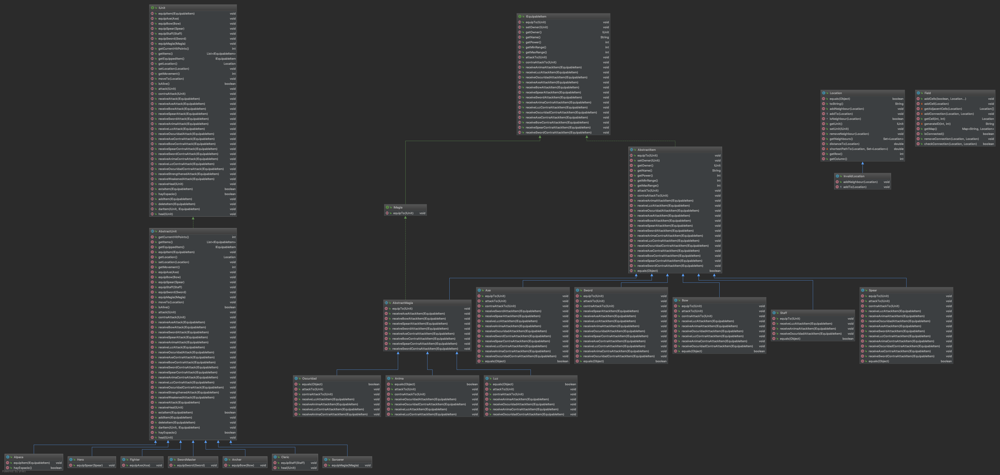

# cc3002 - alpaca-emblem - Homework 1

This is the Homework 1 project, developed using the Java 1.8 SDK. Includes all the files that implements the requested for this work. Here, you can see the UML Java class diagram.
Please refers to the file "uml_diagram.png" in the repo root directory for a better view.

## Design

### ICard Interface

A ICard interface was implemented. This interface allows to the Pókemon and Energies behaves like a card.
This also allows a double-dispatch design interaction when a Trainer plays a card. Please refers to Trainer section for more information.

#### IEnergy interface

This interface describes the behavior of the energies. It allows to store different energies in the implemented data structures and interact with the Pókemon cards.

##### AbstractEnergy

This abstract class implements IEnergy interface. The ElectricEnergy, FightingEnergy, FireEnergy, GrassEnergy, PsychicEnergy
and WaterEnergy was implemented using the AbstractEnergy class. The methods starting with addEnergyToPokemon 
interact with the Pókemon with a double dispatch design interaction, that allows to the Pókemon calls
the proper method to add this energy to his internal storage.

#### IPokemon interface

This interface describes the behavior of a Pokemon. It allow to storage Pókemon in the proper data structures and interact with the energies cards.

##### AbstractPokemon

This abstract class implements IPokemon interface. The ElectricPokemon, FightingPokemon, FirePokemon, GrassPokemon, PsychicPokemon
and WaterPokemon was implemented using the AbstractPokemon class. The methods that allows Pókemon attacks each others
was developed using double-dispatch design interaction, that allows to the Pókemon that receive the attack which kind of 
Pókemon are attacking him. 

## IAbility interface

This interface was developed thinking in the future implementation of more abilities besides the attacks.
At the moment, the only Interface that implements him is IAttack.

### IAttack interface

This interface describes the behavior of a Attack. It allow to storage Pókemon in the proper data structures and interact with the Pókemon cards.

#### Attack class

This class implements IAttack interface. Describes an attack and knows if a Pókemon can perform the attack.

## Data Structures

### AttackContainer class
   This class use a Array to storage up to four attacks.

### EnergyContainer class

This class use a HasMap to storage up to six energy types. Can add energies and return the number of energies that contains.

## Testing

The testing was made using JUnit 4.18 for the unit tests, reaching 100% of line coverage. 
To run all the test, import the git project to your machine, open with IntelliJ Ultimate, 
go to test folder, righ-click and select "Run 'All Test' with Coverage". All the 108 test will pass.

## Authors

* **F. Giovanni Sanguineti** - *Universidad de Chile* - [git repo](https://github.com/fgsanguineti/)

