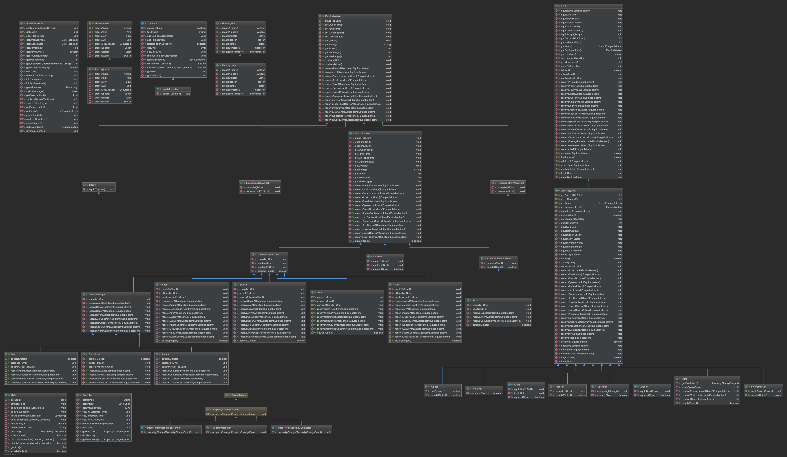

# cc3002 - alpaca-emblem

Este es el proyecto Alpaca Emblem, desarrollado utilizando Java 10 SDK. Incluye todos los archivos que implementan lo solicitado para este trabajo. Aquí puede ver el diagrama de clases Java UML. Para verla mejor, favor referirse al archivo uml_diagramT2.png en la carpeta raíz del proyecto en Github.

## Version 2.0
## Diseño

##### Actualización Items

Se implementan dos nuevas interfaces que extienden IEquipableItem, las cuales diferencian items que atacan de los que no atacan. También se implementan sus clases abstractas correspondientes y se cambia todas las extends de las clases hijas a su clase correspondiente (dependiendo si ataca o no).

### Tactician

Se crea clase Tactician la cual representa a los jugadores. El Tactician, a través del patron de diseño <b>Observer</b>, observa cuando muere su heroe y es observado por el GameController (siguiente sección) cada vez que se muera un héroe o termine el turno. 

Al crear un Tactician, se crea automáticamente un Hero y se le asigna como unidad. Esto para facilitar los test y para asegurar que los Tactician tendrán al menos un Hero (no puede iniciar el juego sin un Hero).

### GameController

Se crea clase GameController que se encarga de controlar todo el juego. El GameController, a través del patrón de diseño <b>Observer</b>, observa cuando un Tactician termina un turno y llama a su método endTurn, y observa cuando muere su héroe y lo elimina del juego. 

### Factory

Se crean dos Factory, siguiendo el patrón de diseño <b>Factory</b>. Una para crear Items y otra para crear Unidades. Cada item y unidad tiene su propio metodo dentro de su Factory correspondiente, lo que permite crear items y unidades sin necesidad de llamar a new Object(...).

### NullPattern

Se implementa NullPattern en items y unidades, NullItem que extiende la clase AbstractItem y NullUnit que extiende la clase AbstractUnit, respectivamente. InvalidLocation es utilizado como <i>Location nula</i>, por lo que no fue neceario crear una location nula.

### Observer

Como se meciona anteriormente, hay dos eventos que se observan, la muerte de un hero y el fin de un turno. Para la muerte de un Hero se implementan dos Handler, uno que interactua entre el Hero y el Tactician (observado y observador respectivamente) y otro que interactua entre Tactician y GameController (observado y observador respectivamente). Para el término de turno se implementó un Handler en el que interactúan Tactician y GameController (observado y observador respectivamente). 

## Testing

El testing se realizó usando JUnit 5 para la unit test, alcanzando un 97% de cobertura de líneas en el paquete controller, 100% 3n paquete factory y 99% en paquete model.
Para ejecutar todos los test, importe el proyecto git a su computador, ábralo con IntelliJ, vaya a la carpeta test, haga clic derecho y seleccione "Run 'All Test' with Coverage". Todos los 145 tests pasarán.

## Version 1.0
## Diseño

### IEquipableItem interface

Se implementó una interfaz IEquipableItem. La interfaz permite a todas las armas comportarse como un item. Esto también permite una interacción de diseño double-dispatch cuando un itemes equipado a una unidad o cuando se ataca a otro item. También permite llevar en el almacenamiento interno de las unidades diferentes armas/items.

#### AbstractEquipableItem

Esta clase abstracta implementa la interfaz IEquipableItem. Las clases Axe, Bow Spear, Staff, Sword se implementaron utilizando la clase AbstractEquipableItem. Los métodos que comienzan con equipTo interactuan con la unidad con una interacción de diseño de double-dispatch, que permite a la unidad llamar el método adecuado para equipar el item.

Los métodos attackTo y los que comienzan con receiveAttack/receiveContraAttack interactúan con la unidad y su item con una interacción de diseño de double-dispatch. Esto permite recibir el tipo de ataque adecuado de cada item.

#### IMagia interface

Esta interfaz describe el comportamiento de los items mágicos (libros mágicos). Permite utilizar los diferentes tipos de items magicos en los métodos de manera diferenciada a las armas normales.

##### AbstractMagia

Esta clase abstracta implementa la interfaz IMagia y extiende la clase AbstractEquipableItem. Anima, Luz y Oscuridad se implementaron utilizando la clase AbstractMagia. 

### IUnit interface

Se implementó una interfaz IUnit. La interfaz permite los distintos personas del juego comportarse de la misma manera, como una unidad. Esto también permite una interacción de diseño double-dispatch cuando una unidad se equipa un item o cuando ataca a otra unidad.

#### AbstractUnit

Esta clase abstracta implementa la interfaz IUnit. Las clases Alpaca, Archer, Cleric, Fighter, Hero, Sorcerer y SwordMaster se implementaron utilizando la clase abstracta AbstractUnit. Los métodos que comienzan con equip permiten que la unidad de equipe el item adecuado con le diseño double-dispatch.

Los métodos attack y los que comienzan con receiveAttack/receiveContraAttack interactúan con el item y su dueño con una interacción de diseño de double-dispatch. Esto permite recibir el tipo de ataque adecuado de cada unidad junto con su item.

Esta clase utiliza un ArrayList para almacenar los items que lleva consigo. 

## Testing

El testing se realizó usando JUnit 5 para la unit test, alcanzando un 96% de cobertura de líneas.
Para ejecutar todos los test, importe el proyecto git a su computador, ábralo con IntelliJ, vaya a la carpeta test, haga clic derecho y seleccione "Run 'All Test' with Coverage". Todos los 102 tests pasarán.

## Authors

* **Geraldine Alvadiz F.** - *Universidad de Chile* - [git repo](https://github.com/galvadiz/)

